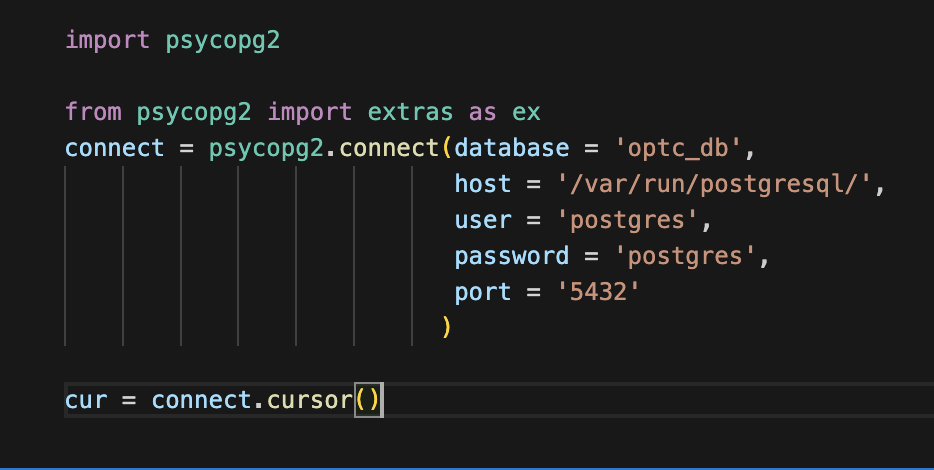
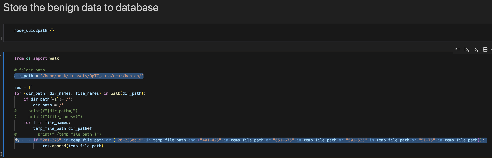
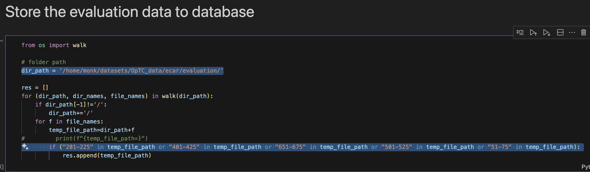
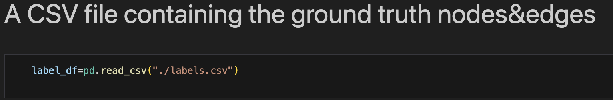

# **KAIROS**

## **Setup:**

1) Fork the GitHub repo ([PIDDL](https://github.com/PIDDL/kairos), [Original](https://github.com/ProvenanceAnalytics/kairos))

2) Clone the GitHub repo (https://github.com/m-shayan73/kairos/tree/reproduce)

3) The paper mentions that all experiments were performed on CentOS 7.9. However, the prerequisites section of [enivorment settings](https://github.com/m-shayan73/kairos/blob/reproduce/DARPA/settings/environment-settings.md) mentions OS as Ubuntu 22.04.1. Also, the PostgresSQL installation guide is for Ubuntu.

    

4) The python libraries section in the [enivorment settings](https://github.com/m-shayan73/kairos/blob/reproduce/DARPA/settings/environment-settings.md) file shown below does not show the commands for all required libraries:

    

5) The [requirements.txt](https://github.com/m-shayan73/kairos/blob/reproduce/DARPA/settings/requirements.txt) file given in the repository has:

    1) local paths for installations.
    2) invalid library version syntax for pyg-lib, torch-cluster, torch-scatter, torch-sparse, torch-spline-conv.
    3) missing matplotlib (used in graph_learning files) and rich (used in optc_datapreprocess.ipynb) dependency.

    

    4) Created a GitHub issue (21st Nov 2024, 13:00): [Link](https://github.com/ProvenanceAnalytics/kairos/issues/15)

6) Wherever possible I have used the libaries mentioned in the [requirements.txt](https://github.com/m-shayan73/kairos/blob/reproduce/DARPA/settings/requirements.txt). For the versions of all the libraries I have used in the reproduction environments, please refer to the [libraries.txt](./libraries.txt) file in my repository.

7) To setup the environment we have used Anaconda 23.3.1. For installation follow the instructions [here](https://docs.anaconda.com/anaconda/install/):

9) Run the following commands (inside conda) to create and run the environment required for threaTrace:

    ```
    conda create -n kairos_env python=3.9
    conda activate kairos_env
    ```
    
9) Install all the dependencies:

    ```
    conda install -y psycopg2 tqdm matplotlib rice
    pip install numpy==1.22.4 scikit-learn==1.2.0 networkx==2.8.7 xxhash==3.2.0 graphviz==0.20.1
    conda install -y pytorch==1.13.1 torchvision==0.14.1 torchaudio==0.13.1 pytorch-cuda=11.7 -c pytorch -c nvidia
    pip install torch_geometric==2.0.0
    pip install pyg_lib torch_scatter torch_sparse torch_cluster torch_spline_conv -f https://data.pyg.org/whl/torch-1.13.0+cu117.html
    conda install -c conda-forge postgresql=15.3   
    ```

    Due to lack of sudo access, I used conda to install postgresSQL.

10) Alternatively, we have provided a [Dockerfile](./Dockerfile) for ease.

    1) Docker build:

        ```
        docker build -t kairos .
        ```

    2) Navigate to the downloaded / cloned kairos repository and run the following command to start the container with the current directory (i.e. kairos's repository) mounted (inside the workspace folder of the container)

        ```
        docker run -it -v "$(pwd)":/workspace kairos
        ```

    3) To find the current / mounted directory inside the container:

        ```
        cd workspace
        ```

8) Download the datasets from the following links:
    [Streamspot](https://github.com/sbustreamspot/sbustreamspot-data), [DARPA Engagement 3](https://drive.google.com/open?id=1QlbUFWAGq3Hpl8wVdzOdIoZLFxkII4EK), [DARPA Engagement 5](https://drive.google.com/drive/folders/1okt4AYElyBohW4XiOBqmsvjwXsnUjLVf)
    The files to download are mentioned in the respective preprocessing code files of each dataset.

9) Follow the instructions mentioned in [kairos's readme](https://github.com/threaTrace-detector/threaTrace) to run the code. Some additional details and issues have been described below in *Running and Evaluating KAIROS* section


## **Evaluation Metrics Mentioned In The Paper**

<div align="center">

| Datasets       | TP  | TN   | FP | FN | Precision | Recall | Accuracy | AUC  |
|----------------|-----|------|----|----|-----------|--------|----------|------|
| Manzoor et al. | 100 | 375  | 0  | 0  | 1.000     | 1.000  | 1.000    | 1.000|
| E3-THEIA       | 9   | 216  | 2  | 0  | 0.818     | 1.000  | 0.991    | 0.995|
| E3-CADETS      | 4   | 174  | 1  | 0  | 0.800     | 1.000  | 0.994    | 0.997|
| E3-ClearScope  | 5   | 112  | 2  | 0  | 0.714     | 1.000  | 0.983    | 0.991|
| E5-THEIA       | 2   | 173  | 1  | 0  | 0.667     | 1.000  | 0.994    | 0.997|
| E5-CADETS      | 7   | 238  | 9  | 0  | 0.438     | 1.000  | 0.965    | 0.982|
| E5-ClearScope  | 10  | 217  | 5  | 0  | 0.667     | 1.000  | 0.978    | 0.989|
| OpTC           | 22  | 1210 | 16 | 0  | 0.579     | 1.000  | 0.987    | 0.993|

</div>


## **Running and Evaluating KAIROS:**

When connecting to the postgres database, change the user and password in the code accordingly:



Also, change the value of *host* to *None* or the location of the file *.s.PGSQL.5432* depending on if you face the issue described in [environment-settings.md](https://github.com/m-shayan73/kairos/blob/reproduce/DARPA/settings/environment-settings.md). In my case, I set it to **None**.

Moreover, change the filePath / path / raw_dir variables in the preprocessing files (or config file for CADETS E3) to the path of the dataset

1) Manzoor et al. (Streamspot):

    1) Pre-trained models:

        <pre>
        tn: 375
        fp: 0
        fn: 0
        tp: 100
        precision: 1.0
        recall: 1.0
        fscore: 1.0
        accuracy: 1.0
        auc_val: 1.0
        </pre>

    2) My trained models:

        <pre>
        tn: 375
        fp: 0
        fn: 0
        tp: 100
        precision: 1.0
        recall: 1.0
        fscore: 1.0
        accuracy: 1.0
        auc_val: 1.0
        </pre>


2) E3-THEIA:

    1) Pre-trained models:

        <pre>
        tn: 215
        fp: 3
        fn: 1
        tp: 8
        precision: 0.7272727272727273
        recall: 0.8888888888888888
        fscore: 0.7999999999999999
        accuracy: 0.9823788546255506
        auc_val: 0.9375637104994903
        </pre>

    2) My trained models:

        <pre>
        tn: 217
        fp: 1
        fn: 1
        tp: 8
        precision: 0.8888888888888888
        recall: 0.8888888888888888
        fscore: 0.8888888888888888
        accuracy: 0.9911894273127754
        auc_val: 0.942150866462793
        </pre>


3) E3-CADETS:

    1) Pre-trained models:

        <pre style="max-height: 300px; overflow-y: auto;">
        2024-11-12 12:27:05 - INFO - Start logging.
        2024-11-12 12:27:05 - INFO - The largest anomaly score in validation set is: 5.097808539947407

        2024-11-12 12:27:05 - INFO - Anomalous queue: ['2018-04-06 11:03:19.756210028~2018-04-06 11:18:26.126177915.txt', '2018-04-06 11:18:26.126177915~2018-04-06 11:33:35.116170745.txt', '2018-04-06 11:33:35.116170745~2018-04-06 11:48:42.606135188.txt', '2018-04-06 11:48:42.606135188~2018-04-06 12:03:50.186115455.txt', '2018-04-06 12:03:50.186115455~2018-04-06 14:01:32.489584227.txt']
        2024-11-12 12:27:05 - INFO - Anomaly score: 797.426908173961
        2024-11-12 12:27:05 - INFO - tn: 174
        2024-11-12 12:27:05 - INFO - fp: 1
        2024-11-12 12:27:05 - INFO - fn: 0
        2024-11-12 12:27:05 - INFO - tp: 4
        2024-11-12 12:27:05 - INFO - precision: 0.8
        2024-11-12 12:27:05 - INFO - recall: 1.0
        2024-11-12 12:27:05 - INFO - fscore: 0.888888888888889
        2024-11-12 12:27:05 - INFO - accuracy: 0.994413407821229
        2024-11-12 12:27:05 - INFO - auc_val: 0.9971428571428572
        </pre>

    2) My trained models:

        <pre style="max-height: 300px; overflow-y: auto;">
        2024-10-31 23:49:37 - INFO - Start logging.
        2024-10-31 23:49:37 - INFO - The largest anomaly score in validation set is: 5.518380539033188

        2024-10-31 23:49:37 - INFO - Anomalous queue: ['2018-04-06 11:03:19.756210028~2018-04-06 11:18:26.126177915.txt', '2018-04-06 11:18:26.126177915~2018-04-06 11:33:35.116170745.txt', '2018-04-06 11:33:35.116170745~2018-04-06 11:48:42.606135188.txt', '2018-04-06 11:48:42.606135188~2018-04-06 12:03:50.186115455.txt', '2018-04-06 12:03:50.186115455~2018-04-06 14:01:32.489584227.txt']
        2024-10-31 23:49:37 - INFO - Anomaly score: 944.0312961730979
        2024-10-31 23:49:37 - INFO - tn: 174
        2024-10-31 23:49:37 - INFO - fp: 1
        2024-10-31 23:49:37 - INFO - fn: 0
        2024-10-31 23:49:37 - INFO - tp: 4
        2024-10-31 23:49:37 - INFO - precision: 0.8
        2024-10-31 23:49:37 - INFO - recall: 1.0
        2024-10-31 23:49:37 - INFO - fscore: 0.888888888888889
        2024-10-31 23:49:37 - INFO - accuracy: 0.994413407821229
        2024-10-31 23:49:37 - INFO - auc_val: 0.9971428571428572
        </pre>


4) E3-ClearScope:

    1) Pre-trained models:

        <pre>
        tn: 112
        fp: 2
        fn: 0
        tp: 5
        precision: 0.7142857142857143
        recall: 1.0
        fscore: 0.8333333333333333
        accuracy: 0.9831932773109243
        auc_val: 0.9912280701754386
        </pre>

    2) My trained models:

        Results do match with the those mentioned in the paper / those I obtain from pre-trained models - my trained model predicts everything as negative.

        <pre>
        tn: 114
        fp: 0
        fn: 5
        tp: 0
        precision: nan
        recall: 0.0
        fscore: nan
        accuracy: 0.957983193277311
        auc_val: 0.5
        /tmp/ipykernel_159491/3255821976.py:88: RuntimeWarning: invalid value encountered in long_scalars
        precision=tp/(tp+fp)
        </pre>

        1) Created a GitHub issue (21st Nov 2024, 16:30): [Link](https://github.com/ProvenanceAnalytics/kairos/issues/17)


5) E5-THEIA:

    1) Pre-trained models:

    2) My trained models:

        1) The train code saves the model as *"model_saved_share"*, but the testing code loads *"model_saved_emb100_BATCH_1024_LastAggregator_multiclass.pt"*

            

            

            Change the path accordingly.

        2) While running the test code, it gives the following error - some graph files (generated during the testing phase) seem to be missing:

            

            1) The files missing in the pred_label dictionary are all those that are (manually) included in attack_list.

                

            2) Created a GitHub issue (21st Nov 2024, 15:30): [Link](https://github.com/ProvenanceAnalytics/kairos/issues/16)


6) E5-CADETS:

    1) Pre-trained models:

    2) My trained models: 
    
        While running the test code, it gives the following error - some graph files (generated during the testing phase) seem to be missing:

        

        1) The files missing in the pred_label dictionary are all those that are (manually) included in attack_list.

            

        2) Created a GitHub issue (21st Nov 2024, 15:30): [Link](https://github.com/ProvenanceAnalytics/kairos/issues/16)


7) E5-ClearScope:

    1) Pre-trained models:

        Results do not match with those provided in the paper:

        

        1) Created a GitHub issue (21st Nov 2024, 16:45): [Link](https://github.com/ProvenanceAnalytics/kairos/issues/18) 

    

    2) My trained models:

        Results do not match with those provided in the paper:

        

        1) Created a GitHub issue (21st Nov 2024, 16:45): [Link](https://github.com/ProvenanceAnalytics/kairos/issues/18)


8) OpTC:

    1) Unlike the previous datasets, it is not explicitly in the preprocessing notebook (*optc_datapreprocess.py*) which files are required.

        1) From the given code, I am assuming we would need the logs in the "ecar" folder. 
        
            Specifically for training, the logs inside the "201-225" folders for dates 17-19 Sept and "401-425", "651-675", "501-525", and "51-75" folders for 20-23 Sept.

            
            
            For evaluation, we would need logs inside "201-225", "401-425", "651-675", "501-525", and "51-75" folders for all dates.

            

        2) Created a GitHub issue (21st Nov 2024, 21:15): [Link](https://github.com/ProvenanceAnalytics/kairos/issues/19)

    1) The groundtruth of OpTC dataset is supposed be in the *labels.csv* file, which seems to be missing in the repository.

        

        1) Created a GitHub issue (21st Nov 2024, 21:15): [Link](https://github.com/ProvenanceAnalytics/kairos/issues/19)